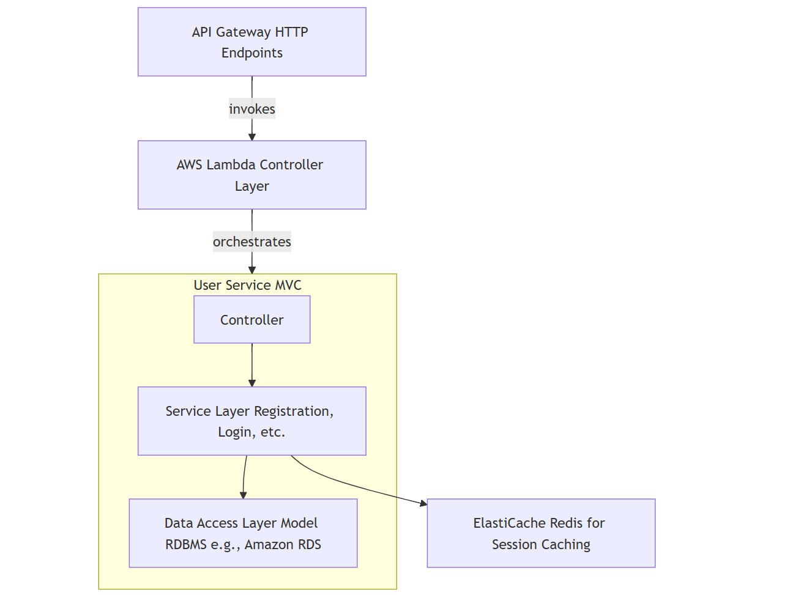

# User Service 

## Overview

This repository provides a serverless User Service for handling user registration, login, profile retrieval, and profile updates. It follows an MVC-inspired architecture deployed on AWS using Lambda, API Gateway, Amazon RDS, and ElastiCache (Redis for session caching).

## Features

- Secure Password Storage with salted hashing (e.g. using bcrypt).
- Session Token Management stored in Redis (ElastiCache) with expiration times.
- Scalable Serverless Deployment using AWS Lambda and API Gateway.
- MVC Structure for clearer separation of concerns.

## Microservices Architecture

### Services and Database Types

## Technologies Used
## Setup and Installation

### Prerequisites

### Clone the Repository
